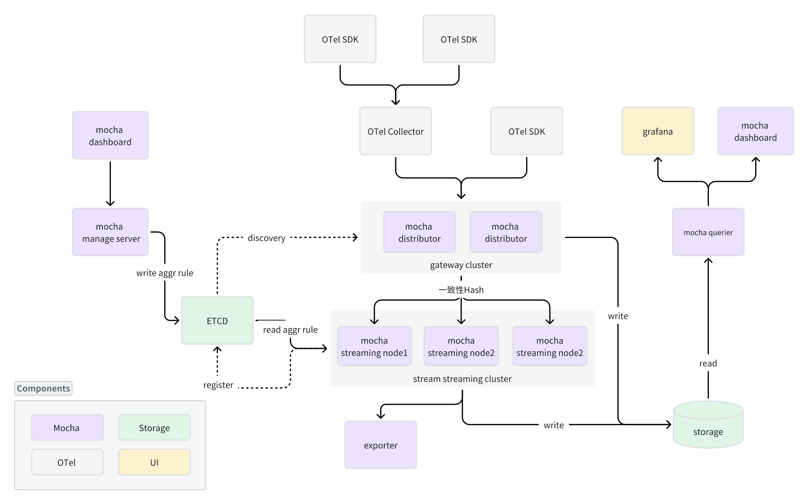

# 背景
近年来，可观测性概念被提出和逐渐流行，OpenTelemetry 也逐渐成为最流行的可观测性框架，OTel 很好的解决了多语言系统中Metrics\Trace\Log 的收集和标准化问题，但对于如何存储和分析使用收集到的 M.T.L 数据，业界并没有统一的方案，一般来说大家需要
1. 使用 Jaeger、Prometheus、Loki 等不同的后端系统搭配，但引入了相当的复杂度
2. 或者引入 SkyWalking 、ElasticAPM 等 APM 系统
3. 或者使用 Datadog、SLS 等 SaaS 可观测性平台，需要支付昂贵的流量和数据存储费用  

同时上述提到的开源 APM 后端，除 SkyWalking [Java实现]外，其余无一例外使用 Golang 实现。
而从 .NET 5 以来，到目前的 .NET 8，每一个版本都对 CLR 和 BCL做了大量性能优化和提供了面向高性能场景的新语言特性，.NET 的演进很适合开发高性能的云原生中间件。所以我们发起 mocha 项目，使用 .NET 实现一个面向大规模可观测性数据分析和存储的平台。
> Mocha 的定位：基于 OpenTelemetry 的 APM 系统，同时提供可伸缩的可观测性数据分析和存储平台。
# 平台功能

Mocha 将要提供的功能集合：
- APM 和 分布式追踪
  - 服务概览、R.E.D 指标和可用性监控
  - 服务拓扑
  - 调用监控，包括 HTTP、RPC、Cache、DB、MQ 等
  - 调用链路查询和检索
- 基础设施监控
  - 主机监控
  - 容器和 Kubernetes 监控
  - 主流中间件监控
- 日志
  - 日志查询
  - 日志聚合分析
- 报警
  - 报警规则管理
  - 报警通知
- M.T.L 数据探索 [Data Explore / Inspect] 
# 技术架构

Mocha 整体架构由下面的部分组成  
- Mocha Distributor Cluster：作为 mocha 系统的数据入口，负责接收 OTel SDK 和 Collector 上报的数据，并通过一致性Hash 将数据路由到对应的 aggregator 节点上。为了保证数据不丢失，最终 Distributor 应该具备本地 FIFO 队列的能力。
- Mocha Streaming Cluster：mocha 的核心组件，通过读取预配置或者用户配置的 aggr rule dsl 生成对应的 streaming data flow 并执行。Streaming 是具备分布式 shuffle 的能力的有状态组件，需要将自身信息注册到ETCD中。
- Storage：mocha M.T.L 存储，可以选用开源存储组件，如 ClickHouse、ElasticSearch、victoriametrics 等。
- Mocha Querier + Grafana: 从存储查询数据并提供给 grafana 做展示。因此要兼容 promql / jeager / loki 等数据源的查询。
- Mocha Manager : 包括 manager server、dashboard和ETCE组件，集群元数据和 M.T.L 数据分析规则存储。
- OTel SDK / Collector : 开源 OpenTelemetry 采集套件。
# 演进规划
我从大概6年前开始，分别参与过开源APM、商业APM产品、超大规模的Metrics/Log底座等不同的可观测性相关系统，并且从多个视角对APM和可观测性体系都有深入的思考，深深知道要实现上面描述的功能和架构是非常不容易的。
所以根据我的经验，在建设 Mocha 的时候我们不能一蹴而就，我们可以遵循最小可行性产品(Minimum Viable Product，MVP)的模式，从先实现一个能跑通 OTel Trace 流程的最小功能集系统开始。
我对 Mocha 的演进思考大概分为三个阶段
1. v1.0 release 目标: 借助开源存储组件[如 ClickHouse，ES..]基础上，实现基于 OTel Trace 的 APM 功能系统
2. v2.0 release 目标: 实现基于 DSL 的流式 M.T.L 分析平台，在这个阶段逐步增强 Mocha 的扩展能力，从 APM 演变为自定义的分析平台
3. v3.0 release 目标: 开始考虑大规模数据下的平台伸缩能力和存储成本，这个阶段会集中在架构性能和低成本 M.T.L 自定义存储上
